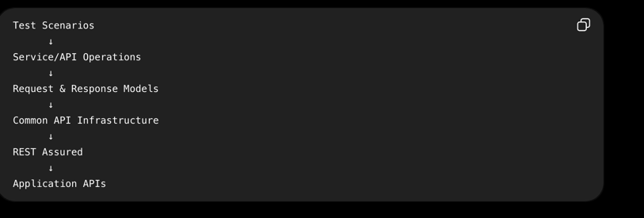

Table of Contents
🎯 Framework Overview
🏗️ Architecture
🧩 Why Service Object Model
🚀 Benefits of SOM
📁 Project Structure
📦 Directory & Class Explanation
🔄 Request Flow
🧪 Test Layer
⚖️ SOM vs Direct REST Assured
🎯 Design Principles
🏢 Enterprise Scalability
🔮 Future Enhancements
🎤 Interview Explanation
🏁 Conclusion

Framework Overview

rest-assured-som-framework is an enterprise-style API automation framework built using:

☕ Java
🧪 REST Assured
🧩 TestNG
📦 Maven
🏗️ Service Object Model (SOM)
🔄 POJO-based request/response serialization
🔐 Centralized authentication
⚙️ External configuration
📊 Reusable assertions and utilities

The primary objective is to create an API automation framework that is:

Reusable + Maintainable + Scalable + Readable + Enterprise Ready

The framework separates:
